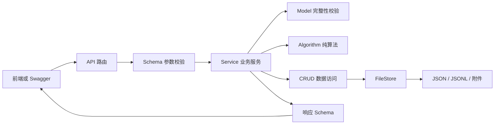

# 宿舍账单分摊管家后端

基于 FastAPI 的本地宿舍公共账单管理系统，提供成员档案、入住关系、账单录入、费用分摊、月度统计、结算建议、CSV 导出和凭证附件管理。项目使用 JSON、JSONL 和本地文件保存数据，不依赖数据库或 Redis，适合课程项目、个人演示和小规模单机使用。

## 项目概览

宿舍公共费用通常由一名成员先垫付，再由多名成员共同承担。系统需要同时区分谁支付了整笔费用、哪些成员参与分摊、每位成员最终应该承担多少，以及一段时间内成员之间应如何转账才能结清余额。

项目以 `Book` 表示一个长期账本，以 `Bill` 表示账本内的一笔公共支出。成员档案 `Member` 在系统内全局保存，成员进入某个账本后建立 `Stay` 入住关系。账单通过当前账本的入住关系校验参与人，并根据平均、入住天数或自定义权重计算分摊结果。

当前实现覆盖课程功能 F1–F11。F12 结算快照、成员确认、撤销和正式结清流程未实现；结算接口只生成建议，不发起线上支付，也不保存付款记录。

## 主要功能

| 模块 | 功能 |
| --- | --- |
| 账本管理 | 创建、分页查询、组合详情、修改和空账本删除 |
| 成员档案 | 全局数字 ID、分页、详情、改名和引用删除保护 |
| 入住管理 | 账本内登记入住、修改日期、退宿及账单引用保护 |
| 账单管理 | 草稿、正式入账、预览、分页、月份筛选、详情、修改和删除 |
| 分摊计算 | `EVEN`、`BY_DAYS`、`BY_WEIGHT`，使用整数分和最大余数法 |
| 月度统计 | 汇总每位成员的月度分摊金额，输出最近六个月趋势 |
| 结算建议 | 按月份范围计算净余额，生成最多六人的最少转账方案 |
| 数据导出 | 按月份导出账单和成员分摊明细 CSV |
| 附件管理 | 上传、分页查询、下载和删除 PNG、JPEG、WebP、PDF 凭证 |
| 文件可靠性 | 跨进程文件锁、安全路径、临时文件和原子替换 |
| 接口规范 | 统一成功响应、中文错误信息、分页结构和 HTTP 状态码 |

## 技术栈

| 类别 | 技术 | 用途 |
| --- | --- | --- |
| 语言 | Python 3.11+ | 业务逻辑、文件存储和算法实现 |
| Web 框架 | FastAPI | REST API、依赖注入、OpenAPI 与 Swagger UI |
| 数据校验 | Pydantic 2 / Pydantic Settings | 请求响应模型、字段约束和环境配置 |
| ASGI 服务 | Uvicorn | 本地运行 FastAPI 应用 |
| 并发控制 | filelock | 全局索引锁和逐账本跨进程锁 |
| 文件上传 | python-multipart | 账单凭证上传 |
| 测试 | pytest、HTTPX | 算法、HTTP、存储、并发与回归测试 |
| 代码检查 | Ruff | 导入、语法和常见问题检查 |

依赖和版本范围以 [`pyproject.toml`](pyproject.toml) 为准。

## 系统架构

项目采用分层设计。路由解析 HTTP 请求并包装响应；Schema 描述前端契约；Service 编排业务流程；CRUD 处理单类记录；Algorithm 负责纯计算；Storage 处理文件锁、安全路径和原子写入。



以创建账单为例，请求依次经过：

```text
POST /api/books/{bookId}/bills
→ BillCreate 校验请求类型
→ bill_service.create_bill 编排创建流程
→ Bill 校验状态与字段完整性
→ splitting_service 校验账本入住成员
→ split_bill 试算并验证金额守恒
→ bill_crud 写入账单
→ FileStore 加锁并原子替换 bills.jsonl
→ ApiResponse[Bill] 返回前端
```

## 项目目录

```text
backend/
├── src/app/
│   ├── api/                 # REST 路由、分页依赖和文件响应
│   ├── core/                # 配置、统一响应、分页和异常处理
│   ├── models/              # 持久化模型及业务不变量
│   ├── schemas/             # 请求模型、分页模型和组合响应结构
│   ├── services/            # 跨资源业务流程与响应数据组合
│   ├── crud/                # 账本、成员、入住和账单文件 CRUD
│   ├── algorithms/          # 分摊与最少转账纯算法
│   ├── storage/             # JSON/JSONL、文件锁、原子写入和迁移
│   └── main.py              # FastAPI 应用工厂和开发启动入口
├── data/                    # 默认业务数据目录
├── docs/                    # API、项目说明、自检和手工测试文档
├── examples/                # 旧格式迁移示例数据
├── tests/                   # 模型、算法、HTTP、并发和存储测试
├── pyproject.toml           # 项目依赖与工具配置
└── README.md
```

## 核心领域模型

| 模型 | 含义 |
| --- | --- |
| `Book` | 共享账本，包含数字 ID、名称、介绍和审计时间 |
| `Member` | 全局成员档案，包含数字 ID 和姓名，不包含登录认证 |
| `Stay` | 成员在某个账本中的入住关系，以 `(bookId, memberId)` 唯一定位 |
| `Bill` | 一笔公共支出，记录金额、日期、参与人、垫付人、分摊方式和状态 |
| `ShareDetail` | 某成员对某笔账单的应摊金额，查询时即时计算，不单独持久化 |
| `MemberBalance` | 月份范围内成员的垫付额、应摊额和净余额 |
| `Transfer` | 建议转账，包含付款成员、收款成员和整数分金额 |
| `Attachment` | 账单凭证元数据，实际文件存放在账本附件目录 |

`Member` 与 `Stay` 分离后，同一成员可以进入多个账本，姓名修改会实时反映在历史账单详情和 CSV 中，不需要批量改写历史账单。

## 账单模型与状态

账单金额使用整数分，例如 `62.00` 元保存为 `6200`，避免浮点数产生金额误差。`participants` 是有序成员 ID 列表，`payerId` 必须属于参与人，并且所有相关成员必须在当前账本具有入住记录。

| 状态 | 含义 | 当前行为 |
| --- | --- | --- |
| `DRAFT` | 草稿 | 允许暂缺业务字段，不参与统计和结算 |
| `POSTED` | 已入账 | 字段必须完整，参与详情、统计、CSV 和结算建议 |
| `LOCKED` | 已锁定 | 为 F12 预留；模型和修改保护已保留 |
| `SETTLED` | 已结清 | 为 F12 预留；模型和修改保护已保留 |

创建账单默认直接保存为 `POSTED`。显式提交 `status=DRAFT` 才保存草稿；完整草稿可以通过 PATCH 提交为 `POSTED`。普通请求不能直接设置 `LOCKED` 或 `SETTLED`，已入账账单也不能退回草稿。

## 分摊算法分析

三种分摊方式最终都转换为整数权重，并调用同一个最大余数分配函数。设账单金额为 `A`，第 `i` 位成员权重为 `wᵢ`，总权重为 `W`。

### EVEN：平均分摊

所有参与人的权重均为 1。例如 1000 分由三人平均承担，基础结果为 333、333、333，剩余 1 分按照参与人原始顺序补给第一人，最终得到 334、333、333。

### BY_WEIGHT：按权重分摊

前端必须为每位参与人提供一个正整数权重，且权重键集合必须与参与人集合完全一致：

```json
{
  "participants": [1, 2, 3],
  "weights": {"1": 3, "2": 2, "3": 1}
}
```

JSON 对象键是字符串，Pydantic 会将其转换为整数成员 ID。6200 分按照 3:2:1 分摊时，算法仍使用整数运算处理尾差。

### BY_DAYS：按有效入住天数分摊

算法取分摊周期和入住区间的闭区间交集：

```text
effectiveStart = max(period.start, stay.joinDate)
effectiveEnd   = min(period.end, stay.leaveDate 或 period.end)
days           = max(0, effectiveEnd - effectiveStart + 1)
```

首尾日期均计入。入住区间与账单周期无交集的成员权重为 0；所有参与人的有效天数都为 0 时，系统拒绝分摊并返回 422。

### 最大余数法与金额守恒

对每位成员执行：

```text
quotientᵢ, remainderᵢ = divmod(A × wᵢ, W)
```

算法先分配所有整数商，再计算尚未分配的分值，按余数从大到小每人补 1 分；余数相同时按照 `participants` 原始顺序决定优先级。全过程不使用浮点数，并保证：

```text
sum(shareCents) == amountCents
```

分摊主要成本来自余数排序，时间复杂度为 `O(n log n)`；宿舍成员规模很小，实际开销稳定。

## 结算算法分析

指定月份范围内只统计 `POSTED` 账单。每位成员的净余额为：

```text
netCents = paidCents - shareCents
```

- `netCents > 0`：成员应收款；
- `netCents < 0`：成员应付款；
- 所有成员净余额之和应为 0。

最少转账算法使用带缓存的递归搜索。每一步选择第一个未清零成员，与相反符号的成员配对，转账 `min(abs(a), abs(b))`，使至少一方余额归零，再比较不同候选路径的转账笔数。相同余额状态由缓存复用。

精确搜索的最坏复杂度随成员数快速增长，因此当前结算服务限制最多 6 名入住成员。该规模可以稳定通过 S01–S08 和结算验收用例；若扩大到大量成员，应改用近似算法或其他优化模型。

## 文件存储设计

```text
data/
├── sequences.json                 # nextBookId、nextMemberId
├── members.json                   # 全局 Member 档案
├── .locks/
│   ├── books-index.lock           # 全局序列和成员数据锁
│   └── book-{bookId}.lock         # 逐账本锁
└── books/
    └── {bookId}/
        ├── book.json              # Book 数据
        ├── stays.json             # 当前账本 Stay 数据
        ├── bills.jsonl            # 每行一笔 Bill
        └── attachments/           # 账单凭证原始文件
```

账本 ID 和成员 ID 是不复用的递增正整数；账单与附件使用服务端生成的字符串 ID。`ShareDetail`、月度余额和转账方案都由当前数据即时计算，不保存容易过期的派生结果。

文件写入流程为：

1. 校验目标路径必须位于配置的数据目录；
2. 获取全局索引锁或逐账本锁；
3. 在目标文件同目录创建临时文件；
4. 写入并执行 `fsync`；
5. 使用 `os.replace` 原子替换目标文件；
6. 异常时清理临时文件并保留旧文件。

不同账本使用独立锁，可以减少无关账本之间的写入竞争。该设计提供单文件原子性和应用内部的并发保护，但不等同于数据库的多文件事务。

## API 与响应规范

所有业务接口使用 `/api` 前缀，健康检查位于 `/health`。成员、账本、入住、账单和附件列表支持 `page`、`pageSize`，分页数据结构为：

```json
{
  "list": [],
  "total": 0,
  "hasMore": false
}
```

普通成功响应：

```json
{
  "code": 200,
  "message": "操作成功",
  "data": {}
}
```

错误响应：

```json
{
  "error": {
    "code": "VALIDATION_ERROR",
    "message": "请输入有效日期，日期必须真实存在且格式为 YYYY-MM-DD",
    "field": "period.end"
  }
}
```

`error.code`、字段名和账单状态属于稳定程序协议，继续使用英文；面向用户的提示使用中文。创建成功返回 201，查询和修改返回 200，删除返回无响应体的 204。

### 主要接口

| 资源 | 方法与路径 | 说明 |
| --- | --- | --- |
| 成员 | `GET/POST /api/members` | 分页查询、创建全局成员 |
| 成员 | `GET/PATCH/DELETE /api/members/{memberId}` | 详情、改名、删除 |
| 账本 | `GET/POST /api/books` | 分页查询、创建账本 |
| 账本 | `GET/PATCH/DELETE /api/books/{bookId}` | 组合详情、修改、删除 |
| 入住 | `GET/POST /api/books/{bookId}/stays` | 分页查询、登记入住 |
| 入住 | `GET/PATCH/DELETE /api/books/{bookId}/stays/{memberId}` | 详情、日期修改、退宿 |
| 账单 | `GET/POST /api/books/{bookId}/bills` | 分页、月份筛选、创建 |
| 账单 | `GET/PATCH/DELETE /api/books/{bookId}/bills/{billId}` | 组合详情、修改、删除 |
| 预览 | `POST /api/books/{bookId}/bill-previews` | 保存前计算分摊，不写文件 |
| 月累计 | `GET /api/books/{bookId}/statistics/member-shares` | 查询成员月度累计分摊 |
| 趋势 | `GET /api/books/{bookId}/statistics/monthly` | 最近六个月趋势 |
| 结算 | `POST /api/books/{bookId}/settlement-plans` | 余额和最少转账建议 |
| 导出 | `GET /api/books/{bookId}/exports/bills.csv` | 月度 CSV 导出 |
| 附件 | `/api/books/{bookId}/bills/{billId}/attachments` | 上传、分页、下载、删除 |

月份筛选使用 `Bill.date` 的 `YYYY-MM`，先筛选再分页。`Bill.period` 只用于 `BY_DAYS` 分摊，不改变账单所属月份。草稿可以出现在账单列表，但不会进入月度累计、CSV 或结算建议。

完整字段与请求示例见 [`docs/API.md`](docs/API.md)。

## 快速开始

以下命令以 Windows PowerShell 为例，在 `backend` 目录执行。

### 1. 创建并安装环境

已有项目 `.venv` 时可以跳过创建命令，直接安装依赖：

```powershell
python -m venv .venv
.\.venv\Scripts\python.exe -m pip install -e ".[dev]"
```

### 2. 启动服务

```powershell
.\.venv\Scripts\python.exe -m uvicorn --app-dir src app.main:app --reload
```

访问地址：

- Swagger UI：<http://127.0.0.1:8000/docs>
- 健康检查：<http://127.0.0.1:8000/health>
- OpenAPI：<http://127.0.0.1:8000/openapi.json>

项目必须使用包含 `filelock` 等依赖的 `.venv`，否则会出现 `ModuleNotFoundError`。

### 3. 环境配置

| 环境变量 | 默认值 | 说明 |
| --- | --- | --- |
| `DORMBILL_APP_NAME` | `宿舍账单分摊管家` | FastAPI 应用名称 |
| `DORMBILL_API_PREFIX` | `/api` | 业务接口前缀 |
| `DORMBILL_DATA_DIR` | 项目 `data/` | 数据目录 |
| `DORMBILL_SEED_DEMO_BOOKS` | `true` | 空数据目录是否创建十个演示账本 |

演示账本只包含名称与介绍，不自动创建成员、入住或账单。已有数据时不会重复注入或覆盖。

## 最小使用流程

### 1. 创建成员

```http
POST /api/members
```

```json
{"name": "张三"}
```

记录响应中的数字成员 ID。

重复调用一次创建第二位成员，后续账单示例使用成员 ID `1` 和 `2`。

### 2. 创建账本并登记入住

```http
POST /api/books
```

```json
{"name": "3栋402宿舍", "description": "宿舍公共费用账本"}
```

```http
POST /api/books/1/stays
```

```json
{"memberId": 1, "joinDate": "2026-03-01", "leaveDate": null}
```

### 3. 预览并创建账单

```http
POST /api/books/1/bill-previews
```

```json
{
  "title": "3月电费",
  "amountCents": 6200,
  "date": "2026-03-31",
  "method": "BY_DAYS",
  "participants": [1, 2],
  "payerId": 1,
  "period": {"start": "2026-03-01", "end": "2026-03-31"}
}
```

预览不会写入文件。确认结果后，将同一请求提交到 `/api/books/1/bills` 完成创建。

### 4. 查看月份账单和结算建议

```http
GET /api/books/1/bills?month=2026-03&page=1&pageSize=10
POST /api/books/1/settlement-plans
```

结算请求：

```json
{"startMonth": "2026-03", "endMonth": "2026-03"}
```

## 附件限制

- 支持 PNG、JPEG、WebP、PDF；
- 单个文件最大 10 MiB；
- 每笔账单最多 3 个附件；
- 同时校验扩展名、Content-Type 和文件头；
- 路径限制在所属账本的 `attachments` 目录；
- 锁定或结清账单禁止新增和删除附件。

## 设计亮点

1. **成员档案与入住关系分离**：全局成员可以进入多个账本，账单仍按照当前账本的入住关系校验。
2. **统一分摊入口**：预览、创建、详情、修改、月统计、CSV 和结算复用同一分摊服务，减少规则分叉。
3. **全程整数金额**：分摊和结算只使用整数分，最大余数法保证账单金额守恒。
4. **动态组合详情**：`BillDetail` 同时返回账单、垫付人、参与人的 Member 与 Stay、即时分摊结果，适合前端直接渲染。
5. **文件型数据库模拟**：按账本划分目录，使用数字主键、引用校验、分页、锁和原子替换模拟数据库常见能力。
6. **并发与故障保护**：ID 分配和写入均在锁内执行，写入失败保留旧文件，并清理临时文件。
7. **算法与业务解耦**：算法层不访问 HTTP 或文件，便于独立测试 T01–T12、S01–S08。
8. **中文接口错误**：框架校验、业务冲突、文件异常统一为稳定结构和中文提示。
9. **安全附件路径**：服务端生成文件名，并校验文件签名与目录边界。
10. **显式功能边界**：F12 未开放路由，避免把预留模型误认为已经完成的支付或结清流程。

## 测试与质量检查

运行全部测试：

```powershell
.\.venv\Scripts\python.exe -m pytest
```

运行静态检查：

```powershell
.\.venv\Scripts\ruff.exe check src tests
```

当前验收结果为 **78 passed**、**All checks passed**。测试覆盖：

- T01–T10 三种分摊方式、最大余数和金额守恒；
- T11–T12 净余额和执行转账后归零；
- S01–S08 最少转账方案；
- Member、Stay、Book、Bill 的 CRUD 与分页；
- 草稿提交、状态限制、月份筛选和修改后重算；
- 多账本隔离、并发 ID、文件锁和写入中断；
- CSV 守恒、六个月趋势和附件限制；
- 中文校验错误与统一响应格式；
- 旧数据迁移、备份和引用完整性。

## 旧数据迁移

旧版逐账本 `members.json` 需要显式迁移。停止应用后执行：

```powershell
.\.venv\Scripts\python.exe -m app.storage.migrate_members --data-dir data
```

迁移会为旧成员分配全局数字 ID，将入住日期写入 `stays.json`，改写账单参与人、垫付人和权重键，校验引用与金额守恒，并在数据目录旁保留迁移前备份。

更早的字符串账本 ID 数据可使用 `app.storage.migrate` 转换到新的独立目录。迁移细节见项目文档和命令帮助。

## 文档导航

- [`docs/API.md`](docs/API.md)：接口、字段、分页和响应结构；
- [`docs/PROJECT.md`](docs/PROJECT.md)：架构、模型和业务规则；
- [`docs/MANUAL_TEST.md`](docs/MANUAL_TEST.md)：F1–F5 手工测试步骤；
- [`docs/FRONTEND_RESPONSE_DESIGN.md`](docs/FRONTEND_RESPONSE_DESIGN.md)：前端响应模型设计；
- [`docs/SELF_CHECK.md`](docs/SELF_CHECK.md)：提交自检与测试结果；
- [`docs/HANDWRITTEN_PLAN.md`](docs/HANDWRITTEN_PLAN.md)：核心代码区域说明。

## 核心代码区域

模型、响应结构、账单服务、分摊和结算的核心范围使用以下注释标记：

```python
##以下为手写
# 核心代码
##手写区域结束
```

相关文件每个只保留一组开始和结束标记，当前覆盖 40/93 个核心设计单元，约 43%。其余代码按项目约定默认归为 AI 生成，底层 `storage` 不纳入该区域。

## 已知边界

- 项目没有注册、登录、权限和线上支付功能；
- 文件后端适合课程和小规模单机数据，聚合查询需要扫描文件；
- 原子替换保证单文件写入完整，不提供跨多个文件的数据库事务；
- 最少转账精确搜索限制最多六名入住成员；
- `LOCKED`、`SETTLED` 和结算快照模型属于 F12 预留，当前没有对应业务路由；
- 修改未锁定的按天账单相关入住日期后，分摊会在下一次查询时依据最新 Stay 重算。

## Git 提交约定

项目使用 `develop` 和 `main` 两个分支：日常修改先提交到 `develop`，测试通过后再合并到 `main`。课程检查和最终交付以 `main` 分支最后版本为准。
